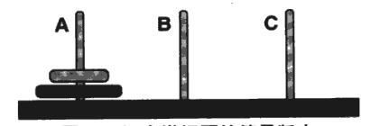

# 3w6dC2T2纪要


## 几点收获

### 关于问题解决

解决任何问题，首先必须有一个我们期望的目标状态，对目标状态的描述越清晰，就越有可能达到这一目标。例如，我们想要得到一个桌面版的交互日记，这是一个目标，但不够清晰，我们并不知道要如何下手。如果我想要得到一个桌面版的交互日记，我就要知道如何利用python生成图形界面。这时我的目标就编程了我要如何利用python生成图形界面，比原来的目标清晰多了。另外，可以任务的范例实现来建立清晰的目标。

目标不是一蹴而就的，为实现最终目标，往往要分成几个阶段性目标。想象你如何将A柱上的两个圆环移动到C柱上。注意：每次只能移动一个圆环；大环不能在小环之上。



目标有主次之分，即我们所说的主要矛盾和次要矛盾。次要矛盾可以暂时搁置，否则很容易偏离主要目标，并造成一万点伤害。例如，完成桌面版交互日记时遇到中文无法保存的问题，可以暂时搁置，改用英文输入保存，等到英文可以输入保存后，再来解决次要矛盾。在解决主要矛盾时慢慢建立成就感，也更有精力解决次要矛盾。


### 关于认识和理解事物
我们只能用已经掌握的概念去理解尚未掌握的概念。因此，在向他人解释新的概念时要考虑到受众的知识背景。另外，比喻是我们认识事物最原始和共通的方式。利用日常生活中的比喻来解释一个概念往往能起到很好的作用。


### 关于python程序
弓箭曰，学习python可以从对象类型、函数、控制流（逻辑）三个方面入手。启发：学习python过程中不可见树木而不见森林，python程序可以分成模块、语句、表达式和对象，这是python的全景图：

* 
对象类型：数字、字符串、列表、字典、元组、文件等
* 
表达式：一个表达式产生一个值。
* 
语句：执行一定的动作，让事情发生。
* 
函数：有输入、运算和输出以执行一定功能的代码段，如果你想复用一段代码，可以使用函数。
* 
模块：如果你想在其他程序中复用许多函数，可以使用模块。
* 
类：面向对象的工具，分类管理代码、复用的强大工具。模块是一个场景下的诸多动作的集合，类是面向对象的。比如苹果是一个类，它有许多属性，比如颜色；它也可以有属于自己的动作，比如削苹果。模块不是面向对象的。函数和类其实都属于语句。

也就是说，python程序由模块构成（每写一段代码都可以保存下来.py,构成一个模块），模块包含语句，语句包含表达式，表达式建立并处理对象。

    >>> length=5      ＃赋值语句
    >>> breadth=2     ＃赋值语句
    >>> length*breadth  ＃表达式
    10
    >>> area=length*breadth   ＃赋值语句
    >>> print(area)    ＃print语句，语句不一定产生一个值
    10


### 关于shell、ipython、编辑器
shell（终端、命令行工具）的作用是执行命令，command＋s可以保存shell，即把里面的所有内容原样保存。python的idle是python自己的shell。要在shell中使用之前写的代码，你要一行一行重新敲击或复制。这时候你就会感受到用编辑器保存脚本的好处。

ipython是增强版的python shell。它可以提高编写、测试、调试代码的速度。在终端中输入```ipython```可以进入ipython模式，输入```quit()``` 退出该模式。

编辑器（比如pycharm）起到编辑代码的作用，在编辑过程中不会执行命令。只有选定代码运行时才会执行。编辑器有许多功能，比如自动补全等。txt是最原始的编辑器。

关于命令行工具的推荐：
* 
iterm（弓箭）
* 
oh my zsh（弓箭）

关于编辑器的推荐：
* 
sublime（谢辉）


### 关于教程
笨方法学python

[python简明教程](http://www.kuqin.com/abyteofpython_cn/)

深入浅出python


## 桌面交互日记的构建过程


### 第1步：导入tkinter模块的内容

```from tkinter import *```

这行代码帮我们导入tkinter模块的所有函数，这样，我们就可以使用该模块中的函数了。记住，上面的代码是导入模块的所有内容，但你不必导入所有内容，尤其是模块特别大而你不会用到所有的函数时，你可以导入部分内容：```from pandas import DataFrame```

我们可以使用import as改变被导入的模块在当前模块中的名称。例如：

```import tkinter as tk```


[函数、类与模块]
如果想要在程序中复用代码，那你就定义函数。函数就是有一定的输入、运算和输出来执行一定功能的一段代码。它把一段逻辑组合起来，可读性也因此提高了。
如果你想要在其他程序中复用许多函数，那你就定义模块。模块里面有函数、类等。它就像一把瑞士军刀，可以让你做许多事情。当然，每次你使用瑞士军刀时，不需要使用所有的功能。模块也一样。
类是面向对象的一个概念，它起到分类管理的目的。类有成员变量和成员函数。拿人做比喻，人有不同的属性（成员变量），比如身高、体重、性格等。人也可以做不同的动作（成员函数），比如吃饭、睡觉、打豆豆。类必须实例化，比如水果可以是苹果或者香蕉。类有继承性，比如水果是一个类，你可以从水果派生出苹果（一个新的类），它继承了水果的属性，比如有颜色属性。


### 第2步：创建类的实例对象:从Tk派生一个myapp类，这是所有widgets的父容器，是一个应用的主窗口
一个模块通常有几个部分组成：导入模块（语句）、函数、类（由函数、语句组成）、语句。

为了更好地管理我即将创建的app，我们将app相关的函数和语句封装在一个类中：

```class myapp(tk.Tk)```

在GUI中，每个Button、Label、输入框等，都是一个Widget。Frame则是可以容纳其他Widget的Widget

### 第3步：添加部件（widgets）到我的主窗口
我们把这些属性／动作封装到一个类的初始化操作中。

    def __init__(self):


__init__（self,[...]）是类别（class）定义中一个特别的方法（method），因为这个方法实在对象（object）建立（创建类的实例）的时候就执行的，即定义一个对象的初始化操作。比如我们想在Tk建立的时候myapp对象建立的时候就添加三个部件。每个对象必须正确初始化后才能正常工作。


    tk.Tk.__init__(self)

调用父类的__init__方法或者说构造函数。如果不这样，父类的构造函数就不会被执行，导致子类实例访问父类初始化方法中的初始变量时出现问题。这就好像你告诉别人“我爸是李刚”，你就可以使用李刚的资源了。


    self.text=tk.Text(self)
    self.text.pack()

调用tkinter模块的Text方法来创建一个文本框部件。调用pack()将该部件加入到父容器当中，并可实现布局

同理可创建Button部件，全部部件的完整代码如下：

    self.text=tk.Text(self)
    self.button=tk.Button(self,text='save',command=self.on_button)
    self.button1=tk.Button(self,text=‘quit’,command=quit)
    self.button.pack()
    self.button1.pack()
    self.text.pack()

Button的text参数可以设定按钮上显示的文字，command参数意味着点击按钮会触发什么程序。

点击save按钮会触发一个自定义的on_button函数：
    
    def on_button(self):
        mydiary=open('mydiary.txt','a')
        mydiary.write(self.text.get(1.0,END)+'\n')
        mydiary.close()

点击qui按钮会触发quit函数：
google:tkinter text quit
[close a tkinter window？](http://stackoverflow.com/questions/110923/close-a-tkinter-window)

以追加的方式打开一个文件（没有的话会自动创建），通过get()获取Text文本框的内容写入文件中（结尾回车），关闭文件并保存


### 第4步：实例化myapp,进入改应用程序的主事件循环

    app＝myapp()
    app.mainloop()
    
    

## 深入
同步显示（将以往的日记内容显示，包括刚刚输入的）

输入中文

显示日期


