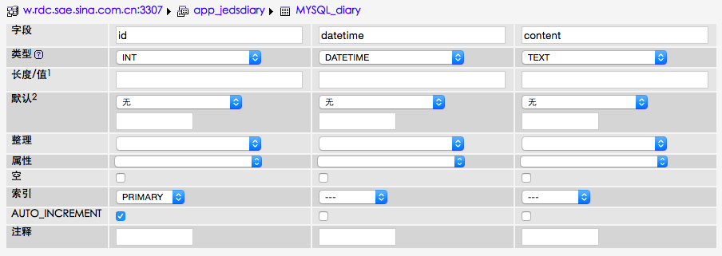

# 公网版私人笔记


# 关于PaaS？


## 什么是PaaS?什么时候用PaaS?
云计算就是使用互联网来接入存储或运行在远程服务器端的应用、数据或者服务。

云计算是分层的。分别是IaaS(底层)、PaaS（中间层）、SaaS（顶层）

PaaS 平台即服务，面向软件开发者，云计算平台提供硬件、os、编程语言、开发库、部署工具，帮助软件开发者更快地开发软件服务。优点（为什么用？什么时候用？）：1、节省了硬件上的费用；2、PaaS excels when multiple developers are working on a single application. It allows for the simultaneous use of a single source code and the ability to automate testing and deployment.（build）

SaaS 软件即服务，面向软件消费者，无需安装，通过浏览器即可食用云计算平台提供的软件，比如goole的gmail。任何一个远程服务器上的应用都可以通过网络来运行，就是saas了（consume）

IaaS 基础设施即服务。购买服务器或硬件，或者外包（host）

资料来源：
http://www.leiphone.com/news/201406/iaas-paas-and-saas.html
http://www.zhihu.com/question/20387284
https://www.techopedia.com/2/28934/technology-trends/software-as-a-service-saas/choosing-between-iaas-and-paas-what-you-need-to-know

## 如何使用PaaS?(how)
换句话说，全球能免费运行python应用网络的有哪些PaaS?

SAE就是其中的一种。它的全称是Sina App Engine， 是新浪内部云计算平台。
http://www.sinacloud.com/doc/sae/python/index.html


# 通过sae创建公网版私人笔记

## 第1步：创建应用
在注册新浪云账号的前提下登录sae，进入[我的首页](http://sae.sina.com.cn/?m=dashboard)，点击创建新应用，创建一个新的应用jedsdiary。 开发语言选择Python。


## 第2步：代码管理
进入应用的代码管理栏目，选择git作为代码管理的工具
打开命令行，创建一个新的git远程仓库：

```$ git remote add sae https://git.sinacloud.com/jedsdiary```

将该仓库克隆到本地:

```$ git clone https://git.sinacloud.com/jedsdiary```

在文件夹中创建应用代码文件：

    cd jedsdiary
    echo >index.wsgi   #接口文件
    echo >jedsdiary.py    #应用代码文件
    git add index.wsgi    #将新文件放至暂存区
    git add jedsdiary.py
    git commit index.wsgi -m "make it better"  ＃提交至本次仓库
    git commit jedsdiary.py -m "make it better"
    git push sae master:1  ＃push到远程仓库


##第2步：编辑应用代码
首先编写接口文件index.wsgi：SAE上的Python应用的入口为 index.wsgi:application

    import sae

    import jedsdiary  #将应用代码文件导入接口文件中

    application = sae.create_wsgi_app(jedsdiary.app) 
    

编写应用代码文件jedsdiary.py

    # -*- coding:utf -8 -*-
    from bottle import Bottle, get, post, request
    
    import MySQLdb
    
    import sae.const
    
    MYSQL_DB=sae.const.MYSQL_DB
    MYSQL_USER=sae.const.MYSQL_USER
    MYSQL_PASS=sae.const.MYSQL_PASS
    MYSQL_HOST_M=sae.const.MYSQL_HOST
    MYSQL_HOST_S=sae.const.MYSQL_HOST_S
    MYSQL_PORT=int(sae.const.MYSQL_PORT)
    
    app=Bottle()
    
    @app.get('/')
    def writediary():
        return '''
            <form action='/' method='post' >
                diary:<input name='diary' type='text'/> 
            </form>
         '''
    
    @app.post('/')
    def insert():
        connection=MySQLdb.connection(host=MYSQL_HOST_M, port=MYSQL_PORT, user=MYSQL_USER, passwd=MYSQL_PASS)
        connection.select_db(MYSQL_DB)
        sql_insert="""insert into MYSQL_diary(datetime, content) VALUES (CURRENT_TIMESTAMP,'"""+request.forms.get('diary')+"""')"""
        connection.query(sql_insert)

这里主要有两大块的内容：（1）我们使用bottle框架来开发我们的web应用；（2）我们用到了SQL数据库接收并管理用户数据。


### 导入bottle、MySQLdb模块和sae的相关常量信息
    from bottle import Bottle, get, post, request
    
    import MySQLdb
    
    import sae.const

其中，MySQLdb是Python连接Mysql数据库的接口，它提供了connection方法来和数据库建立连接,接收多个参数,返回连接对象，例如：
* 
host:数据库主库域名
* 
port:MySQL服务使用的TCP端口
* 
user:数据库用户名
* 
passwd:数据库登录密码

当我们在sae创建MySQL后，sae会在服务首页提供我们数据库的上述信息。

我们将使用sae.const来获取sae的相关常量信息，即数据库的连接信息。这相当于给到我们访问数据库的地址和钥匙。后面我们才能管理数据库，找到地址打开家门。

    MYSQL_DB=sae.const.MYSQL_DB
    MYSQL_USER=sae.const.MYSQL_USER
    MYSQL_PASS=sae.const.MYSQL_PASS
    MYSQL_HOST_M=sae.const.MYSQL_HOST
    MYSQL_HOST_S=sae.const.MYSQL_HOST_S
    MYSQL_PORT=int(sae.const.MYSQL_PORT)


### 创建Bottle类对象实例
    app=Bottle()
实例化后bottle的装饰器就要写成app.route('/')的形式，代表是这个对象的路径。


### 利用form接收用户输入
    @app.get('/')
    def writediary():
        return '''
            <form action='/' method='post' >
                diary:<input name='diary' type='text'/> 
            </form>
         '''

这里的代码基本复用web版私人笔记本。不再赘述。

### 获取form数据并录入SQL数据库

    @app.post('/')
    def insert():
        connection=MySQLdb.connection(host=MYSQL_HOST_M, port=MYSQL_PORT, user=MYSQL_USER, passwd=MYSQL_PASS) #利用获取的sae相关常量信息和我的SQL数据库建立连接，返回连接对象
        connection.select_db(MYSQL_DB) #选择相应的数据库
        sql_insert="""insert into MYSQL_diary(datetime, content) VALUES (CURRENT_TIMESTAMP,'"""+request.forms.get('diary')+"""')""" ＃SQL语法，将当前的日期和时间以及form数据插入到数据库的两个字段下，前提是已在sae上创建数据表
        connection.query(sql_insert)
        
sae支持在图形界面创建数据表：


这里，我们创建了三个字段：id（整型、主键、自动增长）、datetime（datetime型）、content（text型）。
        
        