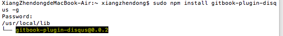
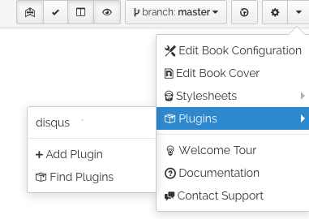

# 写在前面

如何配置DISQUS插件？

解决过程：
从[Gitbook官方教程](help.gitbook.io)的plungis一章找到[插件](https://plugins.gitbook.com/plugin/disqus)，得知Install the Disqus plugin via NPM。如果要配置插件，就要先知道NPM是什么，如何获得。于是百度搜索“gitbook 插件 npm”，返回结果：
[使用Gitbook制作电子书](http://www.ituring.com.cn/article/127645)。从这篇文章得知从[npm官方网站](https://nodejs.org/en/)可以下载安装NPM。 

反思：如果要下载npm以及获知npm的使用信息，可以直接找到[npm的官网](https://www.npmjs.com)和查看documentation。节省无用信息筛选成本

下载安装node.js后，回到[插件](https://plugins.gitbook.com/plugin/disqus)。问题来了：npm是什么？怎么操作？

打开终端，按npm帮助文档的提示安装npm并检查安装版本：

回到[插件](https://plugins.gitbook.com/plugin/disqus)，按操作安装disqus插件：

To use the Disqus plugin in your Gitbook project, add the disqus plugin to the book.json file, along with your shortname (you create a shortname for disqus by creating a new website on the disqus.com website)
问题来了：什么是book.json?怎么操作？

推测可能在gitbook的编辑器里，于是误打误撞通过右上角的设置添加了disqus插件：

这时文件树里多了book.json文件，恍然大悟，点击查看代码内容，

重要资源：

[Gitbook官方教程](help.gitbook.io)
