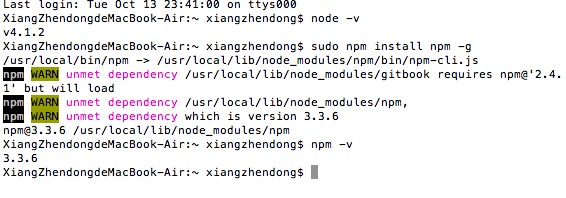

# 写在前面

如何配置DISQUS插件？

解决过程：
从[Gitbook官方教程](help.gitbook.io)的plungis一章找到[Gitbook帮助文档](https://plugins.gitbook.com/plugin/disqus)，得知Install the Disqus plugin via NPM。如果要配置插件，就要先知道NPM是什么，如何获得。于是百度搜索“gitbook 插件 npm”，返回结果：
[使用Gitbook制作电子书](http://www.ituring.com.cn/article/127645)。从这篇文章得知从[npm官方网站](https://nodejs.org/en/)可以下载安装NPM。 

反思：如果要下载npm以及获知npm的使用信息，可以直接找到[npm的官网](https://www.npmjs.com)和查看documentation。节省无用信息筛选成本

下载安装node.js后，回到[Gitbook帮助文档](https://plugins.gitbook.com/plugin/disqus)。问题来了：npm在哪里？
打开终端，按gitbook帮助文档的提示操作：

重要资源：

[Gitbook官方教程](help.gitbook.io)
