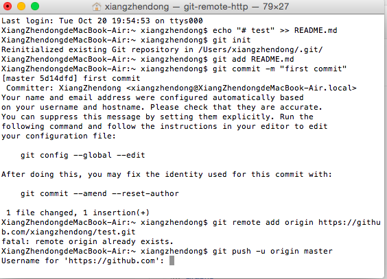
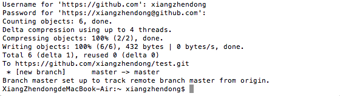
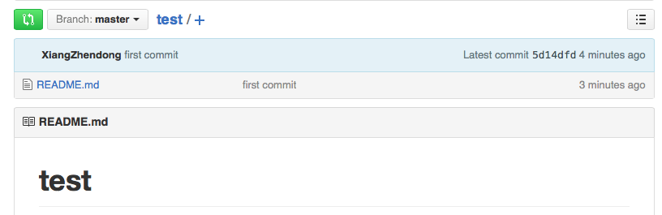

# 0wd6 shenzhen C2T2 纪要

### 关于工具的几点共识
* 
科学上网
* 
google

你不是一个人，你遇到的问题很可能其他人已经遇到过了；
对问题的解决只能靠自己，google只提供信息支持；
学会和google对话

“” 双引号表示完全匹配
A -B 包含A但不包含B
filetype:  搜索指定类型的文件
site: 在指定网站内搜索
link: 网页中含有指定链接
intitle: 标题还有指定内容
等等。
* 
问答：stackoverflow

stackflow为stack exchange旗下的程序编程问答网站。编程牛人都在此。

* 
随手记录尝试过程

准备一个小本子，在解决问题的尝试中，随手记录尝试过程（链接、截图、试验过程等等）。便于总结反思自己的思维过程（元认知）；便于他人快速了解自己遇到的问题并提供帮助

* 
提问


### github和gitbook的双推实现

参见上一篇文章


### 本地编辑文件并推送

打开终端，输入：

```echo "# test" >> README.md```

```git init```  #第一次使用git命令会提示安装git   

```git add README.md``` ＃用git add添加文件

```git commit -m "first commit"```  ＃用git commit命令告诉git把文件提交到仓库；－m后面是本次提交的说明

```git remote add origin https://github.com/xiangzhendong/test.git```

```git push -u origin master``` ＃把local的master分支内容推送到远程的master分支，以后可去掉-u





实现结果：



### git常用的3个命令

git add

git commit

git push


### 前进！

42代码
笨方法学编程


