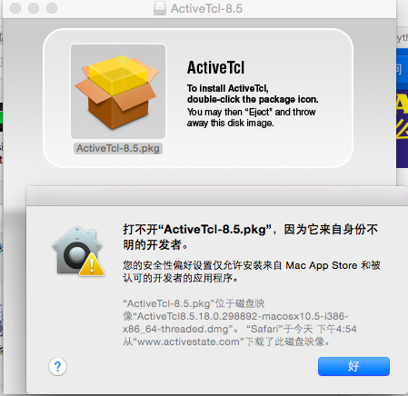

# mac环境下IDLE不支持中文输入问题

# Opening

### 背景
系统环境：MAC OS X 10.10.5
python版本：3.5

### 问题
打开IDLE,切换输入法试图输入汉字，只能输入英文字母

### 解决方案

原因分析：idle界面使用的tkinter依赖tcl／tk，而系统自带的tcl／tk版本太低，造成不兼容的问题（google:mac idle chiese），因此，要想输入中文，需要下载安装最新版的Tcl/Tk

第一步：按照[IDLE and tkinter with Tcl/Tk on Mac OS X](https://www.python.org/download/mac/tcltk/)的说明，根据系统环境选择合适的activetcl下载：根据我的系统环境，我应该选择activetcl8.5.18.0

第二步：下载[activetcl](http://www.activestate.com/activetcl/downloads)，点击安装文件，这时会在桌面出现一个新的名为activetcl－8.5的文件，双击打开，按操作提示安装即可

注意：由于mac的安全设置问题，这里可能会遇到打不开文件的情况。这时可在安全性与隐私中修改设置，打开activestate

