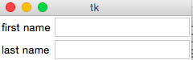

# tkinter


## 什么是tkinter
Tk是一个图形库，它并不是python的一部分。python中的tkinter模块封装了访Tk的接口，完成图形界面的构建


## 如何使用tkinter


### 第1步：导入tkinter的所有内容
```import tkinter```

 or,more often:
```from tkinter import ＊```

>插曲：Tk T大写k小写

错误代码：

    import tkinter
    root tkinter.TK()
    root mainloop()

返回：AttributeError: module 'tkinter' has no attribute ‘tk'

尝试1:```dir(tkinter)``` tkinter有属性"TK"

尝试2:[stackoverflow](http://stackoverflow.com/questions/20997761/tkinter-module-object-has-no-attribute-frame) 还是傻傻分不清楚

尝试3:[ibm](http://www.ibm.com/developerworks/cn/linux/sdk/python/charm-12/)

顿悟：Tk写成TK了

### 第2步：从Frame派生一个Application类，这是所有Widget的父容器
    class Application(Frame):
        def __init__(self, master=None):
            Frame.__init__(self, master)
            self.pack()
            self.createWidgets()

        def createWidgets(self):
            self.helloLabel = Label(self, text='Hello, world!')
            self.helloLabel.pack()
            self.quitButton = Button(self, text='Quit', command=self.quit)
            self.quitButton.pack()


在GUI中，每个Button、Label、输入框等，都是一个Widget。Frame则是可以容纳其他Widget的Widget

pack()方法把widget加入到父容器中，并实现布局

在creatWidget方法中，我们创建了一个label和一个button，当button被电击时，触发self.quit()使程序退出


### 第3步：实例化Application ,并启动消息循环

    app = Application()
    # 设置窗口标题:
    app.master.title('Hello World')
    # 主消息循环:
    app.mainloop()


## 深入学习

### 输入文本

    from tkinter import * 
    import tkinter.messagebox

    class Application(Frame):
        def __init__(self, master=None):
            Frame.__init__(self, master)
            self.pack()
            self.createWidgets()

        def createWidgets(self):
            self.nameInput = Entry(self)
            self.nameInput.pack()
            self.alertButton = Button(self, text='Hello', command=self.hello)
            self.alertButton.pack()

        def hello(self):
            name = self.nameInput.get() or 'world'
            messagebox.showinfo('Message', 'Hello, %s' % name)

当用户点击按钮时，触发hello()，通过self.nameInput.get()获得用户输入的文本后，使用tkMessageBox.showinfo()可以弹出消息对话框。


### 批量输入文本


### Entry Widgets
entry是tkinter用来获得用户输入的基本部件（widgets），它可以让用户输入单行文本。如果你想输入多行文本，就要使用text部件。entry的语法如下：

```w = Entry(master, option, ... ) ```

master代表父窗口（parent window），entry部件会布置在里面。像其他部件一样可以使用属性（options）来进一步修饰entry部件。

下面的程序创造了有两个entry区域的应用（这里没有使用属性）：

    from tkinter import *

    master = Tk()
    Label(master, text="First Name").grid(row=0)
    Label(master, text="Last Name").grid(row=1)

    e1 = Entry(master)
    e2 = Entry(master)

    e1.grid(row=0, column=1)
    e2.grid(row=1, column=1)

    mainloop()


程序运行结果：




    import tkinter as tk

    class SampleApp(tk.Tk):
        def __init__(self):
            tk.Tk.__init__(self)
            self.entry = tk.Entry(self)
            self.button = tk.Button(self, text="Get",    command=self.on_button)
            self.button.pack()
            self.entry.pack()

        def on_button(self):
            print(self.entry.get())

    app = SampleApp()
    app.mainloop()


参考资料：

[廖雪峰的官方网站](http://www.liaoxuefeng.com/wiki/001374738125095c955c1e6d8bb493182103fac9270762a000/0013868326118089581a091a04e4c30b2b7896392bdde5c000)

[可爱的python：python中的tk编程](http://www.ibm.com/developerworks/cn/linux/sdk/python/charm-12/)

[python documentation](https://docs.python.org/3/library/tkinter.html?highlight=tkinter#module-tkinter)

[Tkinter Entry “get” function is returning nothing](http://stackoverflow.com/questions/10727131/tkinter-entry-get-function-is-returning-nothing)


